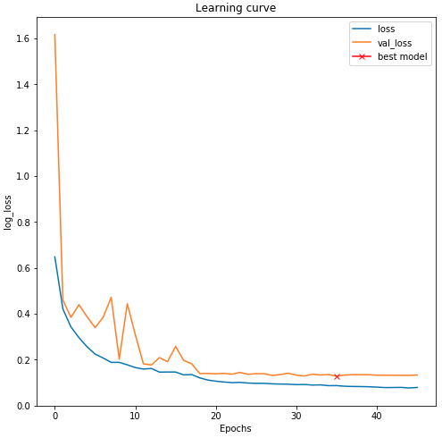

# ground-segmentation
Learning a deep neural network for ground segmentation.

## Usage
### Clone project and install dependencies

```
git clone https://github.com/gaunthan/ground-segmentation.git
cd ground-segmentation
pip install -r requirements.txt
```

### Download dataset
Run `get_dataset.py` to download the dataset. We use cmu-corridor-dataset to train the model.

### View Notebook
#### Launch JupyterLab
Under ground-segmentation, run the following command to launch JupyterLab

```
jupyter-lab .
```

Model definition, training and inference are written in notebook **ground_segmentation.ipynb**.

you can open it in JupyterLab. 

#### View on Web Browser
Or, you can view the notebook on web browser by Jupyter Notebook Viewer.

Click [the lick](https://nbviewer.jupyter.org/github/gaunthan/ground-segmentation/blob/rgb_input/ground_segmentation.ipynb) th view.

## Evaluate The Model
On test set:

loss: 0.1281, accuracy: 0.9546




