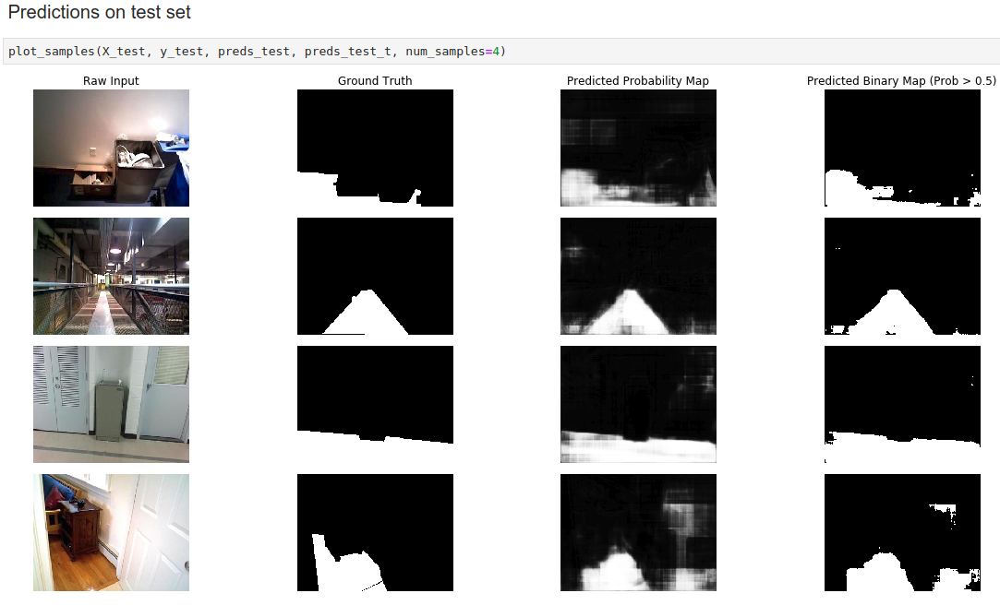

# ground-segmentation
Learning a deep neural network for ground segmentation.

## Usage
### Clone project and install dependencies

```
git clone https://github.com/gaunthan/ground-segmentation.git
cd ground-segmentation
pip install -r requirements.txt
```

### Download dataset
Run `get_dataset.py` to download the dataset.

### Launch JupyterLab
Under ground-segmentation, run the following command to launch JupyterLab

```
jupyter-lab .
```

In JupyterLab, open ground_segmentation.ipynb for better understanding about the project.


## Screenshots



